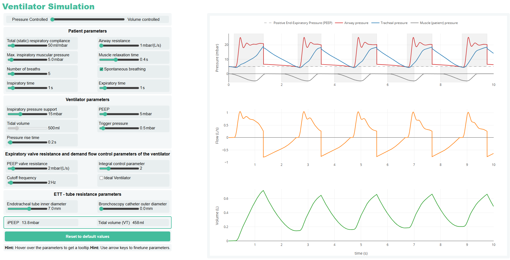

# The Resistance of the Endotracheal Tube During Bronchoscopy

This project demonstrates the effects of catheter insertion into an endotracheal tube (ETT) during bronchoscopy in mechanically ventilated patients. It visualizes how airflow resistance increases and how this impacts ventilation under both volume- and pressure-controlled modes.

👉 **[Click here to view the interactive demo](https://johannes-bartl.github.io/ventilation/)**

## 🧪 Abstract

During bronchoscopy in mechanically ventilated patients, the insertion of a catheter into the endotracheal tube (ETT) drastically increases airflow resistance, potentially compromising ventilation. In this study, we quantify the nonlinear, flow-dependent resistance of ETTs with and without inserted bronchoscopy catheters. Pressure–flow relationships are measured across various tube–catheter combinations.

We find that:
- The resistance of unobstructed tubes scales with the inverse fourth power of the inner diameter.
- With catheters inserted, resistance scales more steeply—closer to the inverse sixth power of the effective diameter.

These increases in resistance lead to:
- **Dynamic hyperinflation and intrinsic PEEP** in volume-controlled ventilation
- **Reduced tidal volumes** in pressure-controlled ventilation

Simulations based on measured resistance values closely match experimental data from intensive care ventilators and lung simulators. This provides a practical framework for anticipating ventilation impairments during bronchoscopic procedures.

## 👨‍🔬 Authors

- Ben Fabry1, Navid Bonakdar1, Christian Kuster1
- Saskia Balling2, Frederick Krischke2, Roland Francis2

1 Department of Physics, Friedrich-Alexander University Erlangen-Nürnberg, Germany  
2 Clinic for Anesthesiology, University Clinics Erlangen, Germany

## 💻 Usage

To test or modify the simulation locally:
1. Clone the repository  
   `git clone https://github.com/johannes-bartl/ventilation.git`
2. Open `index.html` in your browser.

Or view it live at:  
➡️ **[https://johannes-bartl.github.io/ventilation/](https://johannes-bartl.github.io/ventilation/)**

## 📄 License

[MIT License](LICENSE)
